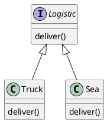

# Notes
- Creational design pattern i.e. responsible for creating objects
- Provides interface for creating objects in superclass but allows subclasses to alter the obect that was created

## Example
- Logistic Management application
- Delivers good via truck only. Need to add another mode of delivery i.e. Ship
- Without factory method the code is coupled with truck only and adding Ship delivery would require substantial changes and a series of if else statements
- To solve this use factory
- Factory method suggests to replace direct construction calls with factory method.
- Objects returned from factory method are called products

